# tidbytes

> **Memory manipulation reimagined with bit addressing**

> Bit & byte manipulation library

# Origins

# Hmmm

The purpose of Tidbytes is to allow bits to be placed precisely where they are
wanted. In the pursuit of mapping this ideal to idiomatic types, some in-built
concepts were uncovered. There really seems to be some fundamental types in
relation to mapping numeric data to bits. "Type" here means an operation either
assuming metadata about an input or an operation requiring metadata as a meta
input. This represents an orientation that points away from the operation and
towards an operation respectively. Some concepts I've uncovered are:

- Unsized data (input data can be mapped to unlimited output data)
- Sized data (input data can be mapped to output data limited by region size)
- Natural data (raw/untyped/uninterpreted/unmapped memory)
- Numeric data (mathematical identity or quantity)
- Unsigned numbers (axis with one polarity)
- Signed numbers (axis with two polarities)

This is design iteration number 3.

Progress was made with iteration number 2 where the concepts Mem and Num were
established which determined bit and byte order deterministically. Namely, Mem
has left to right bit and byte order and Num has right to left bit order and
a byte order that matches the desired endianness. Without this insight, progress
could not be made so the effort involved with iteration 2 ultimately furthered
the goal of a universal, deterministic, and simple bit manipulation library.

The problems with iteration number 2 were that there are just too many different
ways to set bits and they need to be identified in order to move forward.
Specifically, getting (indexing), and setting (indexing and bit decoding) are
orthogonal, although setting builds on the indexing capability of getting.

Indexing memory is complicated because slicing out a range of bits/bytes needs
to work well with setting bits, but reassigning that slice to the original range
is nontrivial. Stepping should not be supported. Also, when setting an integer
data type to the sliced out range, the integer type needs to fit in that new
type but also fit back into the original range.

It would be better to just only allow getting and setting bits using the Mem
type only. Users could call from/into functions for get/set operations so there
would be minimal inconvenience. Catering to the C API doesn't seem to be the
right move here. If the Mem type is kept opaque from the point of view of the
API operations, it should be possible to only use that Mem type to get and set
bits and bytes: `mem.set_bytes(Mem.from_i32(123))`. This means that setting bits
needs to support:

:: Natural API ::
Mem <- get slice as Mem, set slice to number, set range within Mem to that slice

:: Idiomatic API ::
u8[] <- control explicit bit order no matter what
number <- convenience so that ints can be used to set bits

This may be the limit to the necessary complexity of this problem domain.

Furthermore, there seems to be 2 use cases:

- Language agnostic Natural API for getting/setting bits/bytes.
- Idiomatic Python API for structs, slicing, and indexing.

The Natural API closely follows C conventions in order to enable
reimplementation in many languages.

The Idiomatic API needs to be the smoothest experience possible since languages
can support very convenient syntax.

# Num Type Revision

It looks like having a single Num type is not possble because it treats the bit
length of both signed and unsigned numeric values the same. This is not possible
because there are actually 4 code paths: Num[None](+n), Num[None](-n),
Num[N](+n), and Num[N](-n). It's subtle, but the Num[None](-n) is not possible
to factor out because the bit length will change the valid integer range (and
therefore meaning) of negative input values.

To fix this, Num must be replaced with Signed and Unsigned for infinite bits and
I32/etc. and U32/etch for finite bits. This will take care of the need to
truncate to support both signed and unsigned.

# Design Elements

The Natural API will return a memory slice of the same type as the normal
memory type when getting bits or bytes. There are no operations to get memory
and also convert it to language-specific types. That is what conversion methods
are for. Languages can implement any number of conversion functions as makes
sense in their language. Internally, the backing store for the bits could be
integers or an array of u8s in the range 0-1. Even getting one bit returns the
root memory type. Setting bits works the same way, the Natural API will only
accept the Mem type.

The Idiomatic API will be able to convert as many different types as makes sense
into the backing store type and vice versa.

No implicit truncation to lower bit length but allow padding for greater bit
length.

# Codecs

| Codec means En**co**der or **Dec**oder

The job of a codec is to efficiently bring idiomatic types into the algebraic
system of MemRgn. They are exactly analogous to Rust's From & Into traits.

All integers coming from Python will be logical values. They assume numeric data
and so bit order is right to left. To successfully treat a number as a memory
region, they need to be transformed to identity order (bit & byte order being
left to right). Semantically, this is the same because numbers go from right to
left logically since the least significant bit is on the right. The reason any
of this is important is the answer to the question: "what is the second bit?".
For numbers this is the rightmost bit less one. For raw memory, this is the
leftmost bit plus one.

Identity bytes operations always assume the input number is raw memory and not
numeric data. Transformation operations can be performed after initialization if
numeric logic is relevant.

The nomenclature in this file was meticulously chosen to reflect the boundary
between the logical universe of the program (host language) and the physical
universe of the computer. "Natural" in this context refers to what is natural to
the computer: bytes. "Numeric" in this context refers to the base of all data in
a program: numbers. It's literally not possible for there to be non-numeric data
in a program. All data is numeric, even if it is structured because the nested
data will always eventually come down to primitive numbers.

When transforming a numeric value into a memory region of a given size, there
are two ways to go about it. The value can be treated as numeric data or raw
memory. There are multitudinous applications of both such as logical data such
as strings or physical data such as the contents of one memory page. Being able
to effectively slice and transform each is useful and Tidbytes can do them all.

Design notes for this module:
- If the result of a Natural operation is directly returned, there's no need
    to validate the returned memory because all operations validate memory
    before returning.
- The "op" nomenclature always refers to algebraic operations with Natural
    inputs and Natural outputs (the Mem type). Think arithmetic: all ops take
    numbers and return numbers.

# Operation Hierarchy

> Represents a tree of re-implementation so that porting can be performed
    methodically.

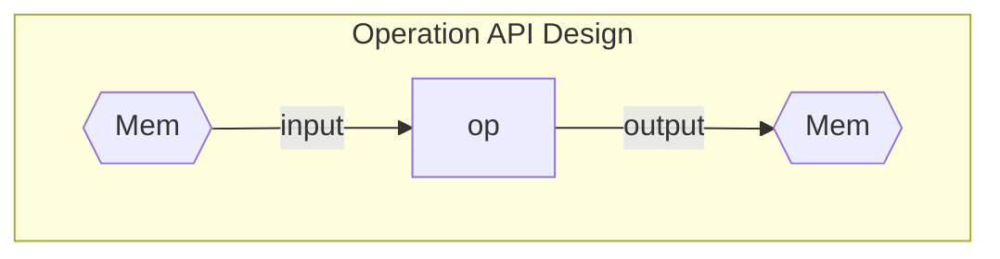

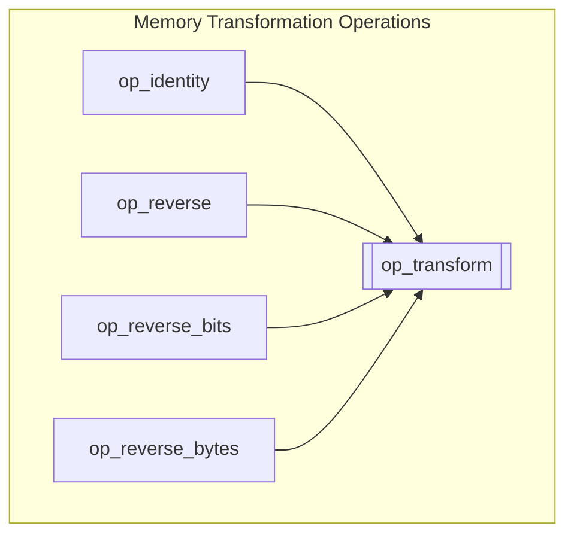

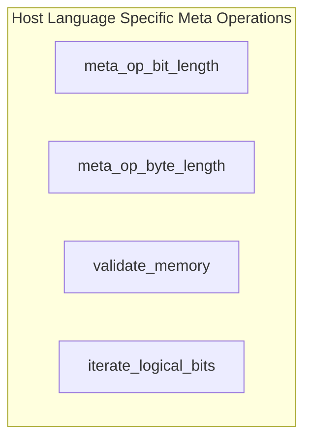

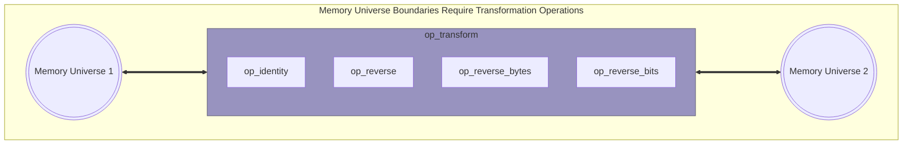

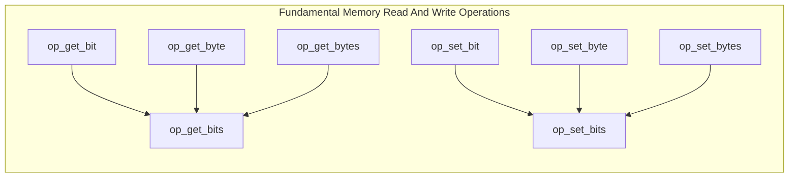

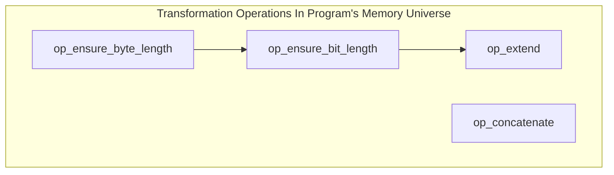

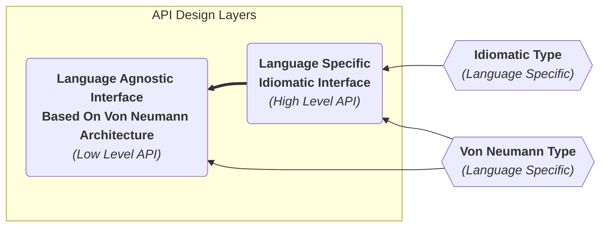

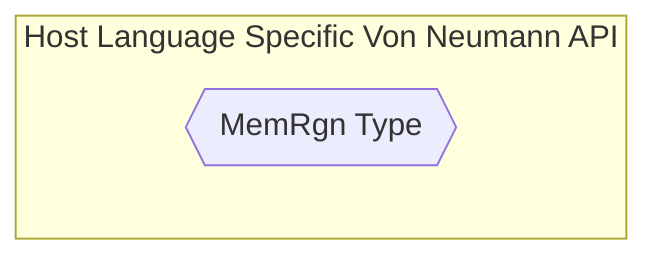

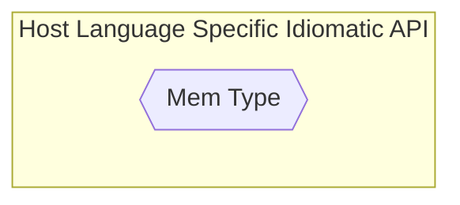

<!-- https://mermaid.js.org/syntax/flowchart.html#styling-line-curves -->
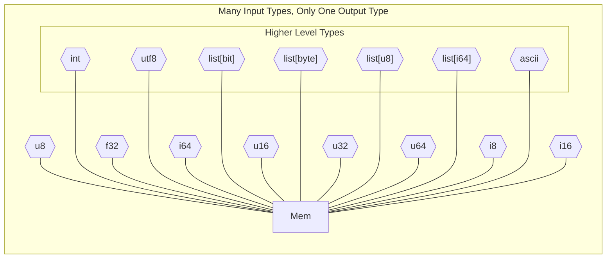

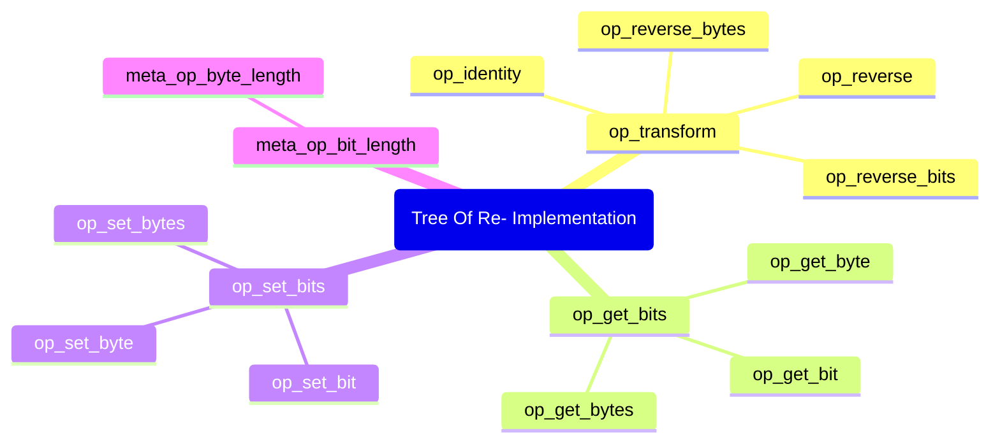

# Operation Notes

- When given a destination bit width of 0, this is like multiplying by 0 in
    arithmetic and results in truncation to null (no bit width).
- Codecs can never start with `op_` since that would mean they are part of an
- algebra. This is fine, but they are not compatible with the Von Neumann API.
