# tidbytes

> **Memory manipulation reimagined with bit addressing**

> Bit & byte manipulation library

# Fully Under Construction (Made Public To Reduce Risk Of Name Squatting)

**Need to create a graph that is the tree of re-implementation so that all the
operations can be created in order in another language.**

# Operation Hierarchy

> Represents a tree of re-implementation so that porting can be performed
    methodically.

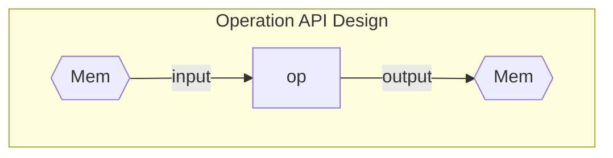

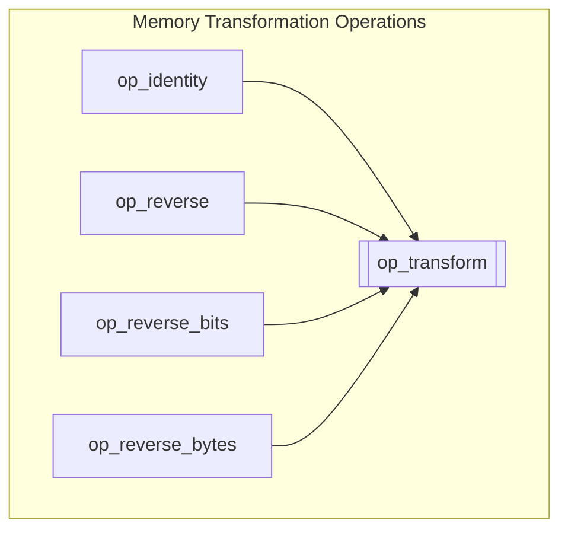

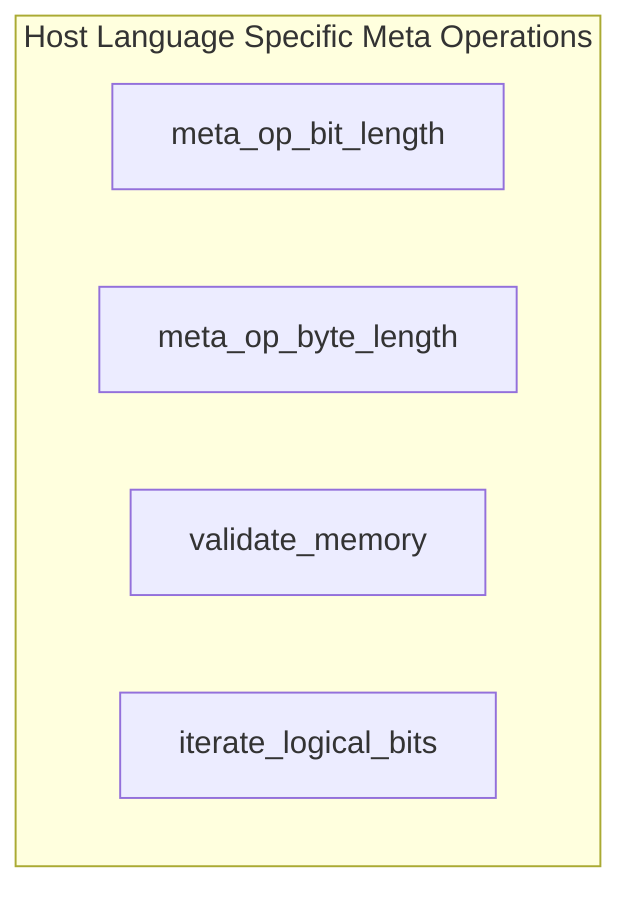

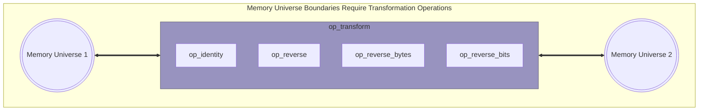

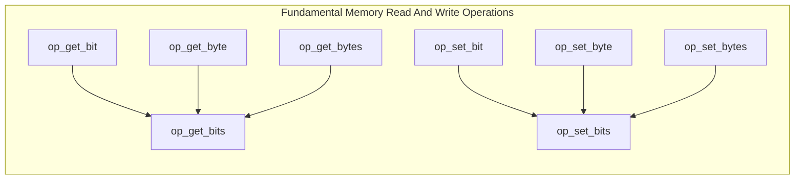

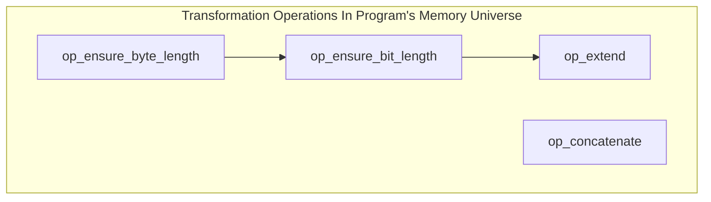

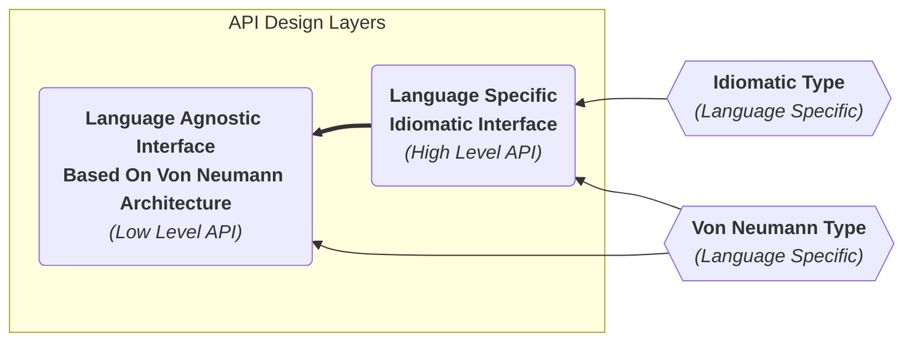

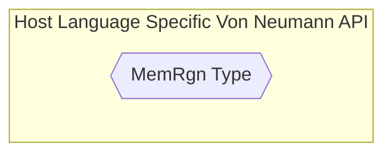

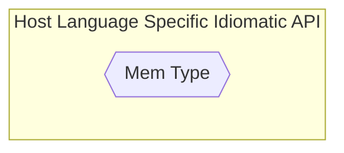

<!-- https://mermaid.js.org/syntax/flowchart.html#styling-line-curves -->
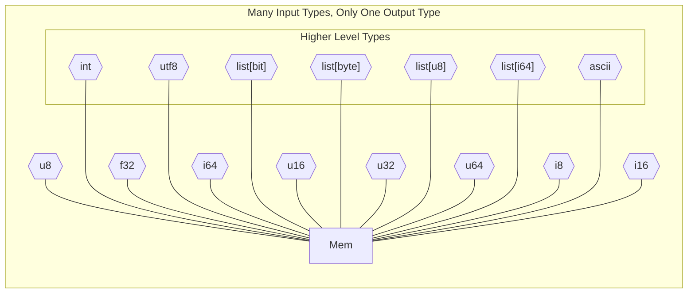

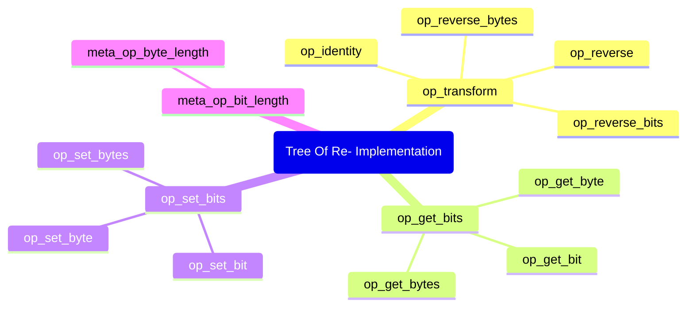

# Operation Notes

- When given a destination bit width of 0, this is like multiplying by 0 in
    arithmetic and results in truncation to null (no bit width).
- Codecs can never start with `op_` since that would mean they are part of an
- algebra. This is fine, but they are not compatible with the Von Neumann API.

# Hmmm

The dream of Tidbytes is to allow bits to be place precisely where they are
wanted. In the pursuit of mapping this ideal to idiomatic types, some in-built
concepts were uncovered. There really seems to be some fundamental types in
relation to mapping numeric data to bits. "Type" here means an operation either
assuming metadata about an input or an operation requiring metadata as a meta
input. This represents an orientation that points away from the operation and
towards an operation respectively. Some concepts I've uncovered are:

- Unsized data (no fixed bit length to limit input data)
- Sized data (bit length)
- Natural data (raw/untyped/uninterpreted/unmapped memory)
- Numeric data (mathematical identity or quantity)
- Unsigned numbers (one axis)
- Signed numbers (two axes)
