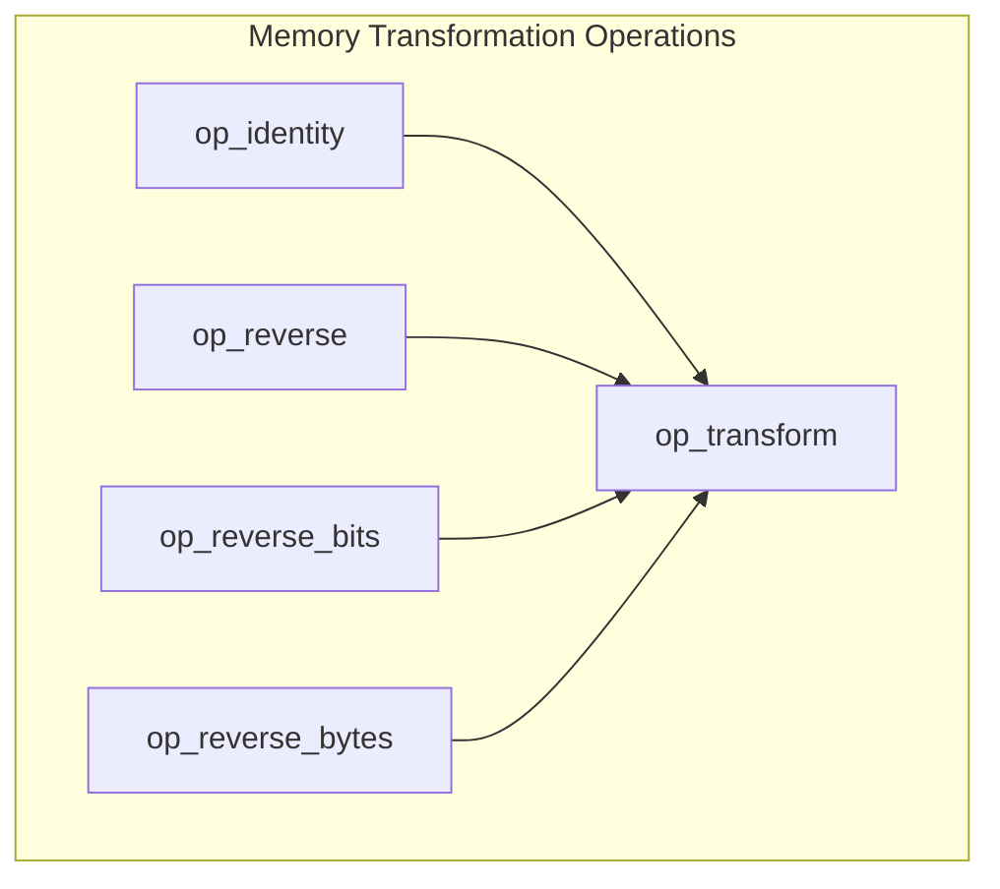
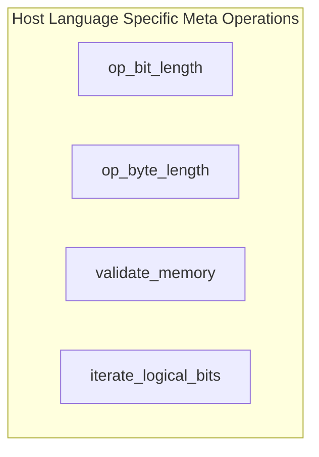
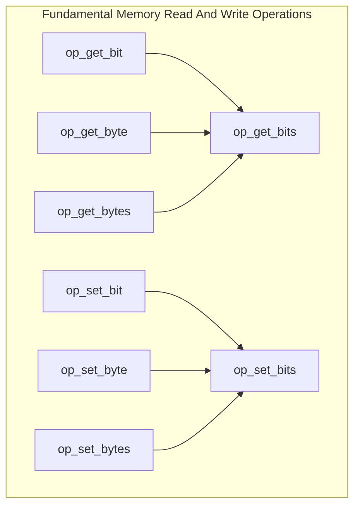
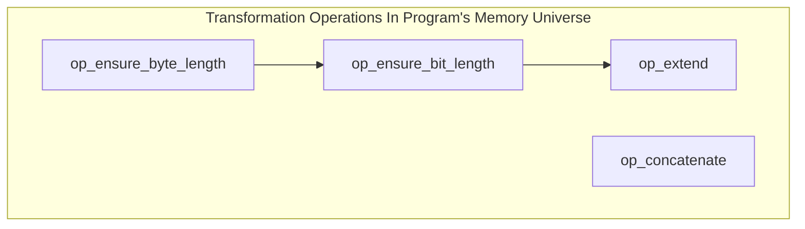
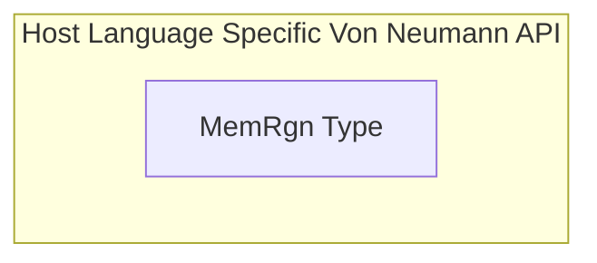
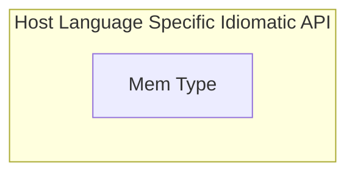

# tidbytes

> Bit & byte manipulation library

# TODO(pbz):

**Need to create a graph that is the tree of re-implementation so that all the
operations can be created in order in another language.**

# Operation Hierarchy

> Represents a tree of re-implementation so that porting can be performed
    methodically.

