# Tidbytes Bit Manipulation Library

> **Memory manipulation reimagined with bit addressing**

The purpose of Tidbytes is to allow bits to be placed precisely where they are
wanted. In the pursuit of mapping this ideal to idiomatic types, some in-built
concepts were rediscovered. There really seems to be some fundamental types in
relation to mapping numeric data to bits. "Type" here refers to a collection of
related operations that either assumes metadata about an input or requires
metadata as a meta input. This represents an orientation that points away from
the operation and towards an operation respectively. Some concepts that relate
to operations that I've rediscovered are:

- **Unsized data** (input data can be mapped to unlimited output data)
- **Sized data** (input data can be mapped to output data limited by region size)
- **Natural data** (raw/untyped/uninterpreted/unmapped memory)
- **Numeric data** (mathematical identity or quantity)
- **Unsigned numbers** (axis with one polarity)
- **Signed numbers** (axis with two polarities)

These types are built into modern processor architectures via Bytes & Indices.
Tidbytes takes these natural computing concepts and provides 2 APIs:

- A lower level API designed to be easily re-implemented in other languages
- A higher level API designed to be as seamless as possible for Python
    programmers

## Higher Level API

```python
from tidbytes import *

U2 = Unsigned[2]  # Type alias
def add(a: U2, b: U2) -> U2:
    return U2(a) + U2(b)

# Underflow and Overflow checks:
add(U2(2), U2(2))  # Error: 4 doesn't fit into bit length of 2 (min 0, max 3)

num = add(U2(2), U2(1))

# Fundamental type conversion support
int(num)  # 3
str(num)  # '11'
bool(num)  # True
float(num)  # 3.0
```

## Lower Level API

The lower level API is much more verbose and not designed to follow Python
idioms but rather to conceptually model C-equivalent semantics when possible.


# The Ninth Bit

<!-- TODO(pbz): Big problem: 8 bit bytes are not from theory/comp or Neumann -->
<!-- TODO: refactor all of this to account for that. -->

<!-- TODO(pbz): Remove "algebra" -->
<!-- TODO(pbz): Remove "Von Neumann" -->

<!-- * GOOD STARTING HERE -->

↪ Reasoning about the ninth bit within the context of programming computers is
not as straightforward as it might seem. It entails preconceived notions on the
part of the programmer about how the runtime CPU architecture loads bits into
registers as well as assumptions around the origin of those bits. The ability to
refer to singular bits is not a capability natural to modern computer
architectures due to byte addressing, but there is utility in doing so
nonetheless. Some applications of referring to bits is data format encoding,
structure bit fields and layout, and machine code instruction encoding. As such,
to get around the limitation of bytes as the lone addressable unit of memory,
bit locations are calculated at runtime through the use of arithmetic and bit
shifting. This is due to the limitations in the available instructions to the
assembly programmer. However, as will be seen below, thinking past this
limitation in a higher level of software provides logical coherency that could
aid application programmers when integrating with lower level libraries,
operating systems, and hardware.


# What Is The Ninth Bit?

Referring to the ninth bit of a region of memory should be trivial. It is, isn’t
it? It turns out that this is not as straightforward as it might seem. Depending
on the byte order, (referred to under the canonical moniker “endianness”), the
ninth bit may appear to the left or the right (not accounting for mixed
endianness) of the first bit (bit zero).

<!-- * GOOD ENDING HERE -->
> ***Tidbytes is based off of the concept of Identity Order which means the
first bit is always the leftmost bit of the leftmost byte.***

## Identity Order

When both the bit and byte order of a region of memory is left to right, this is
called “Identity Order” in Tidbytes.

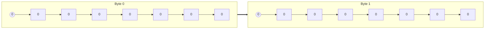

This is the most useful memory order for bit reading (indexing, offsetting) and
writing (set, concat, extend, truncate) operations because it matches most
mathematical notation such as equations and cardinal graphs. For memory in
identity order, it is unlikely to be semantically meaningful in a primitive
(scalar) way. Generally, memory in identity order tends to be for everything
*except* for directly storing data. Floats.

For identity order memory, the first and ninth bits are the leftmost bit of the
leftmost byte and the leftmost bit of the second byte from the left:

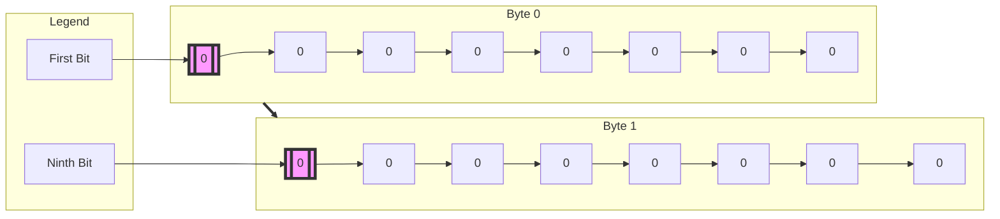

## Numeric Data

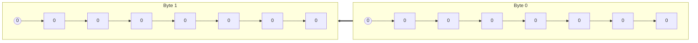

# What Makes Tidbytes An Algebra

<!-- TODO(pbz): I wish this wasn't bogus but it probably will be torn apart. -->
<!-- TODO: Just remove all mention of Neumann and make it about numeric data -->

Tidbytes consists of a single data type: `MemRgn`, and a collection of
operations that takes `MemRgn` as a type of input and always produces `MemRgn`
as an output. `MemRgn` represents a region of memory of a given bit (not byte)
length, even though the Von Neumann computer architecture only allows memory
regions of a given byte (not bit) length. In both cases, memory is not the only
built in concept: addresses are also a fundamental concept to the Von Neumann
computer architecture. They can represent indexes (addresses), offsets (program
∂counter), and lengths (region byte width). This means that the Von Neumann
architecture natively supports numeric data as it pertains to addressing,
offsetting, and slicing memory. As such, numeric data is the only other type of
input type to the fundamental Tidbytes operations.

> *It should be noted that “Von Neumann Architecture” is referring mostly to
memory consisting of a sequence of bytes rather than the ALU, Controller, Store,
or IO components. As such, this designation might be closer to the theory of
computation than a specific computer architecture.*

# Memory Operations

- `op_identity`: maps a memory region to itself (multiplies by 1)

- `op_reverse_bytes`: transforms little endian to big endian and vice versa

- `op_reverse_bits`: reverses the bits of each byte while maintaining byte order

- `op_reverse`: reverses both bits and bytes, effectively flipping the entire
    region

- `op_get_bits`: slices out a range of bits into another range of bits

- `op_set_bits`: sets a range of bits with another range of bits

- `op_truncate`: remove additional space if greater than provided length

- `op_extend`: fill additional space with a value if less than provided length

- `op_ensure_bit_length`: fill or remove space if less or greater than length

- `op_concatenate`: combine two memory regions from left to right

# What’s with the “Natural” Nomenclature

“Natural” in this case is referring to basically the Von Neumann computer
architecture since it is by far the most used in practice. Technically, it is
referring to the theory of computation rather than a specific computer
architecture.

# Glossary of Terms

- Natural: Refers to the bit (and most commonly) byte order of a given processor
    architecture: the memory universe. It is from the point of view of the host.

- Foreign: Refers to a memory universe of another processor host, regardless if
    it exactly matches.

- Origin: Refers to which memory universe a memory region was allocated.

- Identity: When a memory region has been processed so that it has left to right
    bit and byte order: the first bit is the leftmost bit of the leftmost byte
    and the ninth bit is the leftmost bit of the second byte from the left.

# Memory Origin And Universes

Every memory region within a given program has an origin. Fundamental properties
of memory origin include bit and byte order. For the purposes of Tidbytes, only
pure left-to-right and right-to-left bit and byte orders are supported, leaving
split order as an future extension, should it prove it’s utility.

The most common orders are left-to-right (little endian) and right-to-left (big
endian). Big endian matches how things are written while little endian matches
zero-indexing of bytes.

Although it is commonly thought that bits always go from right-to-left, on
occasion they also go from left to right. This can be the case when slicing out
bit fields from structs that are smaller that a byte or otherwise cross byte
boundaries. In such cases, is the first bit on the far right or on the far left?
This is an intriguing duality. Memory origin does seem to matter then. When
considering the entire struct, the first bit is always the leftmost bit of the
leftmost byte. When considering numeric data, the first bit is the rightmost bit
of the rightmost byte. Strange.

The use case for transforming between memory universes often comes up when
reading from a file or a network socket. When reading bytes from a file, they
are read (logically) from left to right one at a time. These bytes come from an
entirely separate memory universe: the universe of the file format. Once they
have been read into memory, they are now within the memory universe of the
program, although they have not yet been transformed to identity order.

> ***Amazingly, simply applying a foreign memory region’s bit and byte order as
a transformation on itself produces that same region in identity order, easily
usable by the host program. This is a surprising insight which ensures that the
“first bit” is always the leftmost bit of the leftmost byte.***


However, each individual byte is generally treated as a C `char` so it is
effectively a numeric value having right-to-left bit order and a pre-declared
byte order dictated by the file format.


read from file

this leaves

show how to index bits in ASM and C operations

zero-indexing bytes

reverse indexing bytes for numeric values

Numeric: R2L bits, R2L bytes

LE Numeric: R2L bits, L2R bytes

Logical/Identity: L2R bits, L2R bytes

“Numeric Universe”.


# TLDR;

Take the origin of a region of memory and perform the corresponding memory
transformation operation to map it to identity order in the natural host CPU
memory so that bits and bytes are always from left to right.

| Foreign Order | Natural Order | Transformation Operation |
|---|---|---|
| Big Endian | Little Endian | `op_reverse_bytes` |
| Little Endian | Big Endian | `op_reverse_bytes` |
| Big Endian | Big Endian | `op_identity` (no op) |
| Little Endian | Little Endian | `op_identity` (no op) |

# So What Truly Is The “Ninth Bit”

By taking a foreign memory region and applying it’s own bit and byte order as a
transformation upon itself it yields a region with identity memory order,
wherein the “ninth bit” is always the leftmost bit of the second byte from the
left.


# Origins & Iteration Info

<!-- TODO(pbz): Idk where to put this stuff but it represents the full story
that won't be reflected if moved -->

Progress was made with iteration number 2 where the concepts Mem and Num were
established which determined bit and byte order deterministically. Namely, Mem
has left to right bit and byte order and Num has right to left bit order and
a byte order that matches the desired endianness. Without this insight, progress
could not be made so the effort involved with iteration 2 ultimately furthered
the goal of a universal, deterministic, and simple bit manipulation library.

The problems with iteration number 2 were that there are just too many different
ways to set bits and they need to be identified in order to move forward.
Specifically, getting (indexing), and setting (indexing and bit decoding) are
orthogonal, although setting builds on the indexing capability of getting.

Indexing memory is complicated because slicing out a range of bits/bytes needs
to work well with setting bits, but reassigning that slice to the original range
is nontrivial. Stepping should not be supported. Also, when setting an integer
data type to the sliced out range, the integer type needs to fit in that new
type but also fit back into the original range.

It would be better to just only allow getting and setting bits using the Mem
type only. Users could call from/into functions for get/set operations so there
would be minimal inconvenience. Catering to the C API doesn't seem to be the
right move here. If the Mem type is kept opaque from the point of view of the
API operations, it should be possible to only use that Mem type to get and set
bits and bytes: `mem.set_bytes(Mem.from_i32(123))`. This means that setting bits
needs to support:

:: Natural API ::
Mem <- get slice as Mem, set slice to number, set range within Mem to that slice

:: Idiomatic API ::
u8[] <- control explicit bit order no matter what
number <- convenience so that ints can be used to set bits

This may be the limit to the necessary complexity of this problem domain.

Furthermore, there seems to be 2 use cases:

- Language agnostic Natural API for getting/setting bits/bytes.
- Idiomatic Python API for structs, slicing, and indexing.

The Natural API closely follows C conventions in order to enable
reimplementation in many languages.

The Idiomatic API needs to be the smoothest experience possible since languages
can support very convenient syntax.

<!-- TODO(pbz): Idk where to put this stuff but it represents the full story
that won't be reflected if moved -->

# Operation Hierarchy

> Represents a tree of re-implementation so that porting can be performed
    methodically.

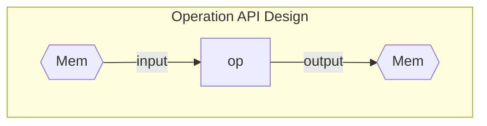


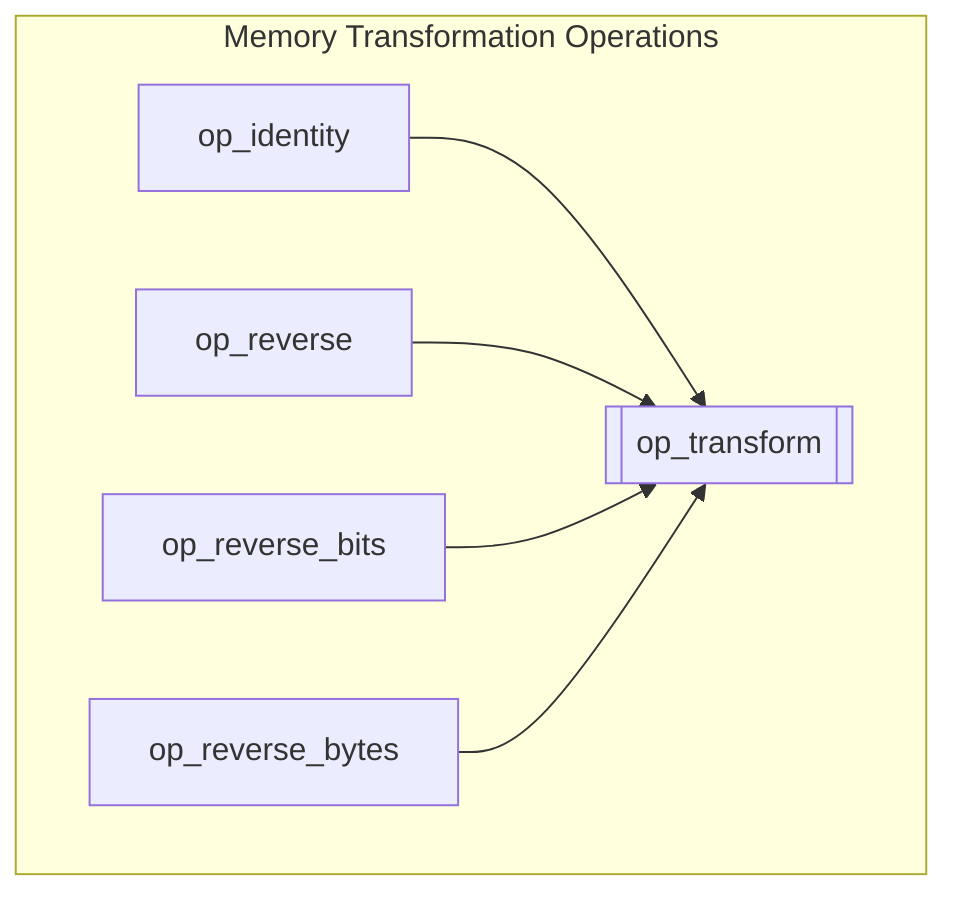

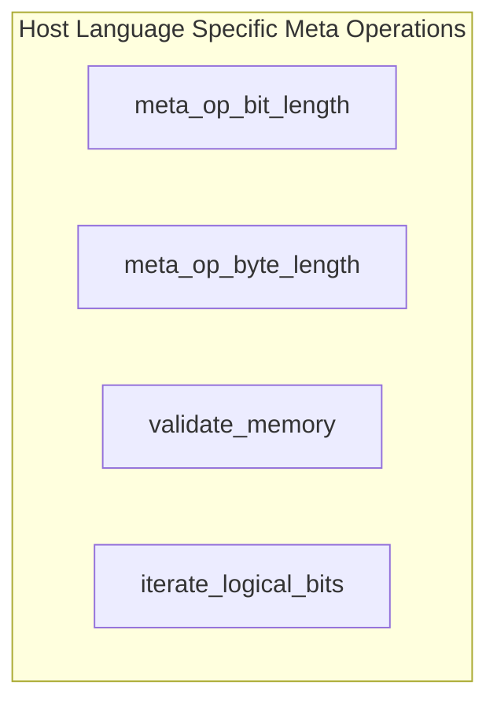

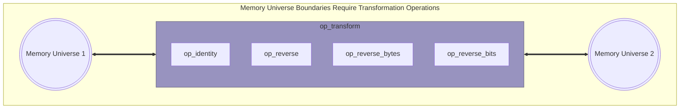

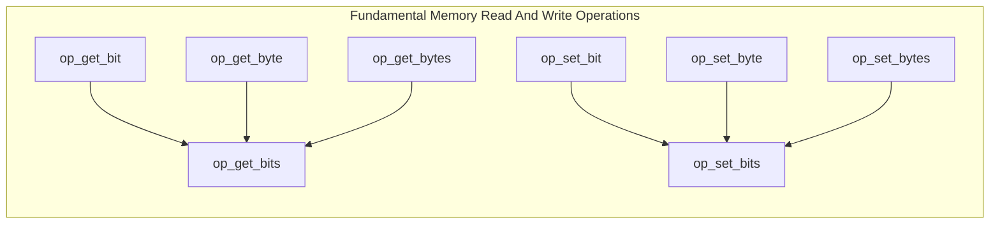

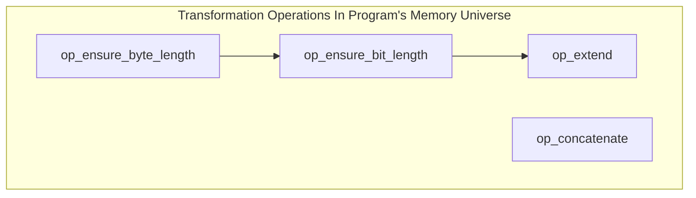

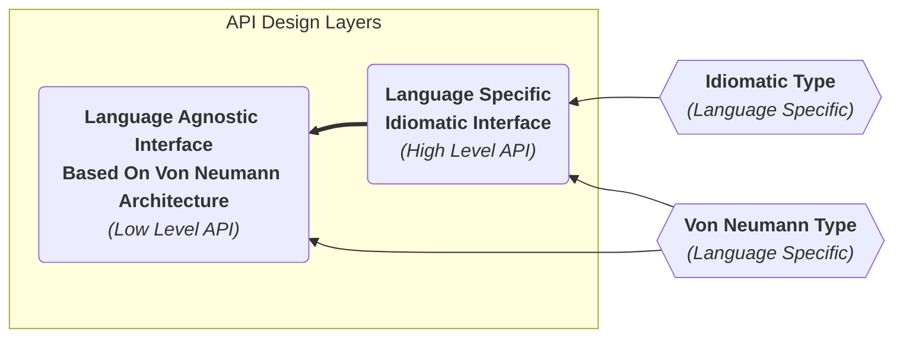

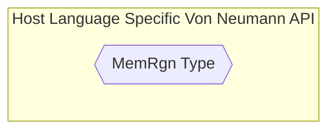

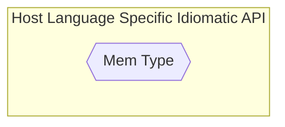

<!-- https://mermaid.js.org/syntax/flowchart.html#styling-line-curves -->
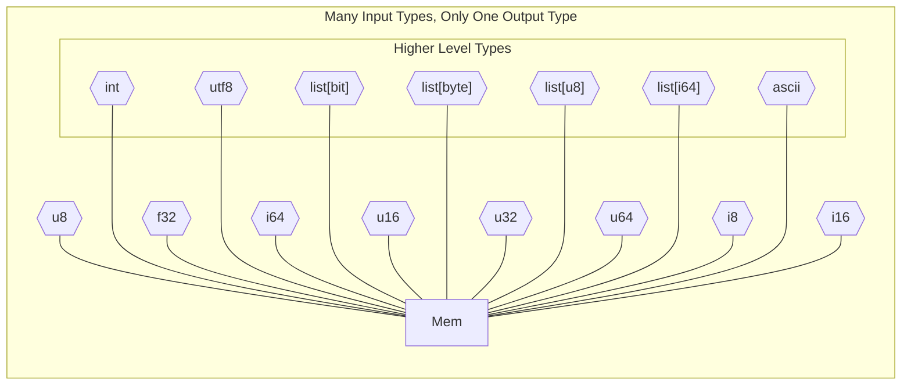

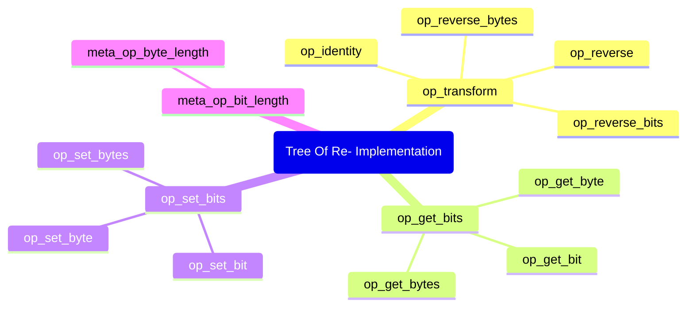

# Operation Notes

- When given a destination bit width of 0, this is like multiplying by 0 in
    arithmetic and results in truncation to null (no bit width).
- Codecs can never start with `op_` since that would mean they are part of an
- algebra. This is fine, but they are not compatible with the Von Neumann API.
